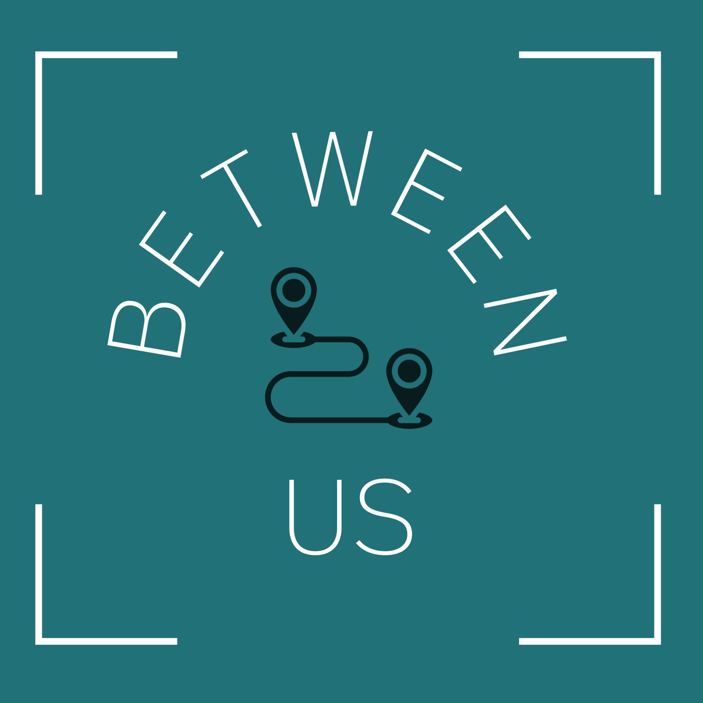

# Between Us 

#### Created By Joseph Jack

## Description

## Component Diagrams

### Research & Planning Log

#### Friday, 9/16

* 8:00: Create initial project and readme, capstone-proposal.md
* 8:30: Fill out capstone proposal template
* 9:10-10:15: Research UI libraries that are responsive, well documented, alot of components and customizable.
* 10:15: Research Google API's Geocoding and Geolocation
* 11:00: Signed up for google api account , acquied key, looking at tutorials on using geocoding with react.
* 11:50: Finish component diagram
* 12:00: Create basic components based off diagram - taking lunch
* 1:30: Don't know firebase yet so today installing necessary frameworks and more research
* 2:30: Spent some time downloading and configuring vs studio and looking into api's with react to better plan my approach
* 3:00: Creating logo for application
* 4:20: Finished creating rough draft logo for application- further exploration into hooks and firebase
* 4:58: Logging off for now- want to get headstart on HW to understand firebase

#### Friday, 9/23

* 10:22: Researching documentation on Api and how to implement (and how to make multiple calls / change data before final call)
* 10:45: For dynamic requests google has a constructor and method built in that returns an object literal - looking into that

## Logistics

## Setup/Install
