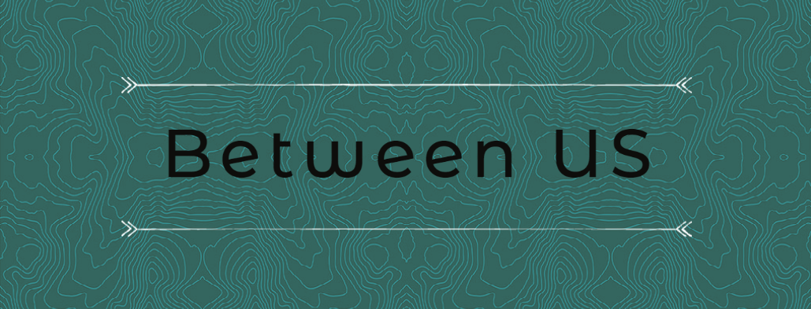

# Between Us 

<div style="display: flex; justify-content: center"><p align="center"></p></div>

#### Created By Joseph Jack
<hr/>

## Description
Between Us takes the input of two addresses and finds the halfway point to meetup and displays points of interest. Get a randomly selected meetup spot, or keep clicking until something sounds good.
<hr/>

## Component Diagrams

<div style="display: flex; justify-content: center"></div>


## Logistics / MVP

|||
|-----|-----|
| :ballot_box_with_check: |User can register|
| :ballot_box_with_check: |User can sign in and sign out from navbar|
| :ballot_box_with_check: |User can enter two locations into form|
| :ballot_box_with_check: |Application finds midpoint coordinates from input locations|
| :ballot_box_with_check: |Application returns randomly selected restaurants near midpoint|
| :ballot_box_with_check: |User can click again for different suggestion|
<hr/>

## Stretch Goals

|||
|-----|-----|
| |Result page displays map with markers of all 3 locations and path|
| |Results return links to restaurant websites|
| |Shows travel time and directions|
| |Filter by hotel/park/cafe & other points of interest|
| |Nearby search radius changes based on result quantity|
| |Profile saves previous searches and locations|
| |Polish styling and layout|

## Setup/Installation Requirements

1. Clone this projects repository into your local directory following [these](https://www.linode.com/docs/development/version-control/how-to-install-git-and-clone-a-github-repository/) instructions.

2. Open the now local project folder with [VSC](https://code.visualstudio.com/Download) or an equivalent

3. Navigate to the project directory from your terminal by entering the following:

```
$ cd ~/between-us
```
4. Within the projects directory install all required dependencies with
```
$ npm install
```

5. Run the application to view in your browser with
```
$ npm run start
```

>If the browser does not automatically launch, view the project [here](https://localhost:3000)

<hr/>

## Known Bugs

- 
- 

<hr />

## Technologies Used

- JavaScript
- React
- Firebase
- Firestore
- Bootstrap
- HTML
- CSS

### Research & Planning Log

#### Friday, 9/16

* 8:00: Create initial project and readme, capstone-proposal.md
* 8:30: Fill out capstone proposal template
* 9:10-10:15: Research UI libraries that are responsive, well documented, alot of components and customizable.
* 10:15: Research Google API's Geocoding and Geolocation
* 11:00: Signed up for google api account , acquied key, looking at tutorials on using geocoding with react.
* 11:50: Finish component diagram
* 12:00: Create basic components based off diagram - taking lunch
* 1:30: Don't know firebase yet so today installing necessary frameworks and more research
* 2:30: Spent some time downloading and configuring vs studio and looking into api's with react to better plan my approach
* 3:00: Creating logo for application
* 4:20: Finished creating rough draft logo for application- further exploration into hooks and firebase
* 4:58: Logging off for now- want to get headstart on HW to understand firebase

#### Friday, 9/23

* 10:22: Researching documentation on Api and how to implement (and how to make multiple calls / change data before final call)
* 10:45: For dynamic requests google has a constructor and method built in that returns an object literal - looking into that

## Legal

_Copyright 2022 Joseph Jack_